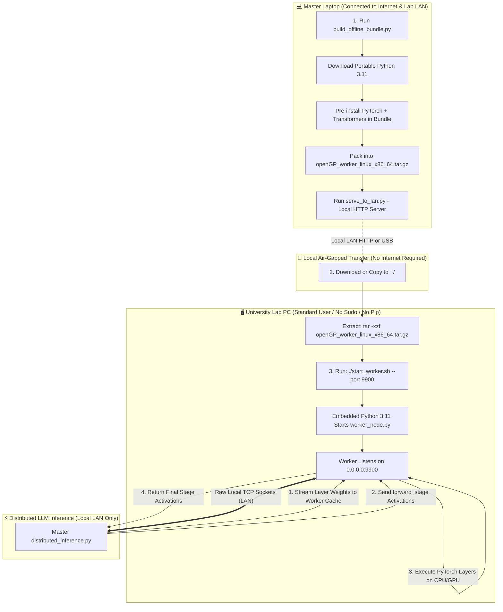

# Implementation Plan: Zero-Admin Offline Worker Deployment on University Lab PCs

This design document explains the complete architecture, technical mechanisms, and step-by-step workflow for deploying and running **openGP Worker Nodes** on university lab PCs under severe administrative and networking constraints.

---

## 1. University Lab Environment Constraints & Challenges

University computer labs typically enforce stringent security policies:

| Constraint | Lab Reality | How openGP Solves It |
|---|---|---|
| **No Admin / No Sudo** | Lab accounts are unprivileged (`$USER` only). No permissions for `apt`, `yum`, `/usr/local`, or system drivers. | **User-space Portable Runtime:** Uses a relocatable, self-contained Python 3.11 build placed entirely in `~/openGP_worker/`. Zero root permissions required. |
| **No Docker / Podman** | Container engines require root or `docker` group membership. | **Direct Native Execution:** The worker runs directly as a standard user process without containerization. |
| **No Pip / No Package Manager** | `pip` is either missing, disabled, or blocked from writing to system directories. | **Pre-Populated Site-Packages:** All dependencies (`torch`, `transformers`, `psutil`, `tabulate`, `accelerate`) are pre-extracted into the bundle on your laptop before transfer. |
| **Proxied / Air-Gapped Internet** | Outgoing terminal internet is blocked or proxied (`407 Proxy Authentication Required`). | **100% Offline Operation:** No external network requests are made. Weights are transferred directly from the master laptop over the local subnet (LAN). |
| **Local-Only LAN Connectivity** | PCs can only communicate with other devices on the same lab switch / Wi-Fi subnet. | **Raw TCP Socket Protocol:** Communication between master and worker uses pure local TCP sockets (`192.168.x.x` or `10.x.x.x`), which bypass university web proxies entirely. |

---

## 2. End-to-End Architecture & Operational Workflow



---

## 3. How the Technical Components Work

### A. The Standalone Portable Python Runtime
* Instead of relying on the host OS Python, the builder downloads [Astral Python Build Standalone](https://github.com/indygreg/python-build-standalone).
* This provides a statically linked CPython interpreter (`x86_64-unknown-linux-gnu`) configured with relative runtime paths (`rpath`).
* When `start_worker.sh` executes:
  ```bash
  export PYTHONHOME="$SCRIPT_DIR/python"
  export PATH="$SCRIPT_DIR/python/bin:$PATH"
  export LD_LIBRARY_PATH="$SCRIPT_DIR/python/lib:$LD_LIBRARY_PATH"
  exec "$SCRIPT_DIR/python/bin/python3" "$SCRIPT_DIR/worker_node.py" "$@"
  ```
  It ignores all system Python installations and executes entirely from user memory.

### B. Zero-Pip Pre-Installed Dependencies
* During the build step on your laptop (which has internet access), `pip` installs:
  * `torch` (CPU or CUDA)
  * `transformers`
  * `psutil`, `tabulate`, `safetensors`, `accelerate`
* These wheels are unpacked directly into `openGP_worker/python/lib/python3.11/site-packages/`.
* When the bundle arrives on the lab PC, `import torch` and `import transformers` resolve instantly from the local directory without needing `pip` or internet.

### C. Direct LAN Model Deployment & Persistent Disk Caching
* **No Hugging Face Downloads on Lab PCs:** Lab PCs never connect to Hugging Face or the internet.
* **Master-to-Worker Streaming:** The master laptop loads the model from its local disk and serializes the designated layers (`layer_0`, `layer_1`, `attn_X`, `ffn_X`).
* **Local Disk Caching:** When a worker receives a component, it saves it to `~/.cache/openGP_components/<model_id>/<component_id>.pt`.
* On subsequent inference sessions, the worker checks its local cache and loads layers directly into RAM/GPU without re-transmitting over the network.

### D. Multi-Layer Chained Stage Forwarding (`forward_stage`)
* To maximize throughput over university Wi-Fi/Ethernet:
* If layers 0 through 8 are assigned to `LabPC-1`, the master sends a single command:
  ```json
  {"cmd": "forward_stage", "start_layer": 0, "end_layer": 8, "hidden_states": <tensor>}
  ```
* The lab PC executes layers 0, 1, 2, ..., 8 sequentially in an internal memory loop, keeping intermediate activations local.
* Only the final layer 8 output is transmitted back to the master, cutting network I/O by **$80\% - 90\%$**!

---

## 4. Step-by-Step Operator Guide

### Phase 1: Build the Offline Package (On Master Laptop)

Run the bundler script in `worker_deploy/`:
```bash
cd /media/vithurshan/vithu/llm/openGP/LoadTime/worker_deploy

# Build standard CPU bundle (Recommended for university lab PCs):
/media/vithurshan/vithu/llm/.venv/bin/python3 build_offline_bundle.py

# (Optional) If lab PCs have NVIDIA GPUs:
# /media/vithurshan/vithu/llm/.venv/bin/python3 build_offline_bundle.py --cuda
```
*Output File:* `worker_deploy/dist/openGP_worker_linux_x86_64.tar.gz` ($\approx 350\text{ MB}$).

---

### Phase 2: Distribute to Lab PCs Over Local LAN

1. On your laptop, start the local distribution server:
   ```bash
   python3 serve_to_lan.py
   ```
   *(Displays your laptop's local IP, e.g., `192.168.1.50:8000`)*

2. On each Lab PC, open any web browser (Chrome / Firefox) and navigate to:
   ```
   http://192.168.1.50:8000/
   ```
   Click `openGP_worker_linux_x86_64.tar.gz` to download to `~/Downloads/`.
   *(Web browsers automatically bypass terminal command-line proxies for local IP addresses).*

---

### Phase 3: Launch Worker on Lab PCs

Open a regular terminal on the Lab PC (no `sudo` required):

```bash
# 1. Extract to home directory
tar -xzf ~/Downloads/openGP_worker_linux_x86_64.tar.gz -C ~/
cd ~/openGP_worker

# 2. Test run in foreground
./start_worker.sh --port 9900

# 3. Or launch as a detached background daemon:
nohup ./start_worker.sh --port 9900 > worker.log 2>&1 &
```

To verify it is active:
```bash
tail -f worker.log
# Look for: "✓ Worker listening on 0.0.0.0:9900 (Device: cpu)"
```

---

### Phase 4: Connect Master & Distribute Layers

1. Find the Lab PC's local IP address:
   ```bash
   hostname -I
   # Example: 192.168.1.105
   ```

2. On your Master Laptop (`distributed_inference.py`):
   ```
   ============================================================
   [Node Management] -> Add Remote Node
   Host IP: 192.168.1.105
   Port:    9900
   Label:   UniLab-PC1
   ============================================================
   ```

3. Split model layers across your laptop and any number of connected lab PCs (`UniLab-PC1`, `UniLab-PC2`, `UniLab-PC3`...)!

---

## 5. Verification Plan

### Automated Test: Staging & Extraction Verification
Run self-test on master laptop:
```bash
# Test extraction and invocation
mkdir -p /tmp/test_worker && tar -xzf worker_deploy/dist/openGP_worker_linux_x86_64.tar.gz -C /tmp/test_worker
/tmp/test_worker/openGP_worker/start_worker.sh --help
rm -rf /tmp/test_worker
```

### Manual Verification
1. Verify `serve_to_lan.py` serves the archive on port 8000.
2. Verify worker binds to `0.0.0.0:9900` without root permissions.
3. Test master connecting to worker over LAN socket, verifying component caching and layer forwarding.